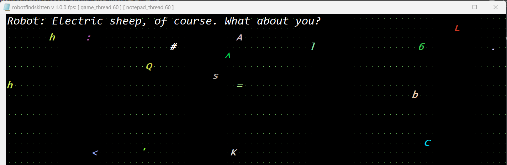

# robotfindskitten



`robotfindskitten` is a my reimplementation of the game [originally](https://github.com/robotfindskitten/robotfindskitten) written by
[Leonard Richardson](https://www.crummy.com/software/robotfindskitten/), now
inside the Notepad.exe and uses the Entity Component System by the great [EnTT]🚀.

The game uses DLL injection to modify the notepad and replace the default Win32 EditControl with [Scintilla]. 

Also, You can find a little gun, so be careful with it!

A video Let's Play:

https://github.com/autogalkin/robotfindskitten/assets/97976281/1d351bcf-15a5-4494-a250-1b6636e05c47


[Scintilla]: https://www.scintilla.org
[EnTT]:  https://github.com/skypjack/entt


## Getting Started

The game can works only with the old version of Notepad.exe before Windows 11. To get it:
- Open Settings > Apps
- In the center pane select Advanced app settings > App execution aliases
- Toggle off Notepad

And download the game:
- Download Pre-built binaries from [Releases page](https://github.com/autogalkin/robotfindskitten/releases).
- Unpack and run `loader.exe`

## Build

In this project I wanted to practice with glm and boost libraries and I use
`vcpkg` for:
- boost
- glm
- EnTT

I created CMakePresets for 64-bit builds based on Ninja and MSVC. To build the game, run:

```
cmake . --preset x64-release
cmake --build --preset x64-release --target install
```
Binary files will be located in the *./out/bin/x64-release* directory.


## Details

- I have implemented a cool header only Quad Tree collision detection algorithm based on
[@DragonEnergy] article, You can check it in
*src/robotfindskitten/game/systems/collision.h*. Tests are located in
*tests/test_collision.cpp*
- I update the notepad message pipe from GetMessageW() to the PeekMessageW() inside
  hook_GetMessageW() so now the notepad does not sleep for a message, just poll and run
  as a real game.

- Remove Notepad's main menu and status bar, and changes the window title to fit the game's context

- The game uses fixed time step with with 60 fps (*src/robotfindskitten/engine/time.h*).

[@DragonEnergy]: https://stackoverflow.com/questions/41946007/efficient-and-well-explained-implementation-of-a-quadtree-for-2d-collision-det

## Special thanks

- [render-with-notepad](https://github.com/khalladay/render-with-notepad) for
  showing the abilities to implementation.

- [SuperNotepadBros](https://github.com/branw/SuperNotepadBros) for the clean iat table's hook example and an good game's time

- the long and intresting story with examples about quad tree by user @DragonEnergy on [stackoverflow](https://stackoverflow.com/questions/41946007/efficient-and-well-explained-implementation-of-a-quadtree-for-2d-collision-det)

